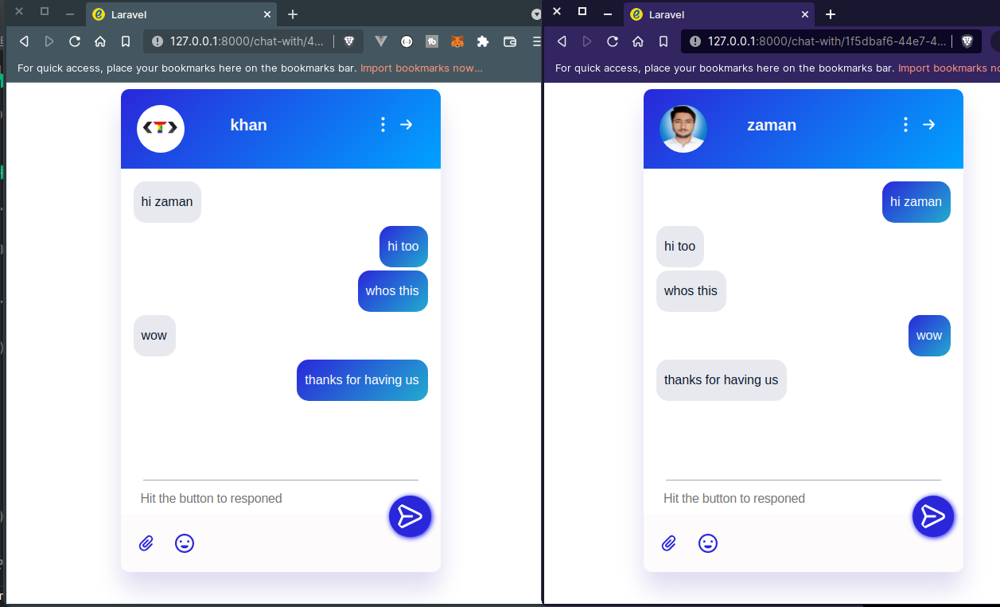
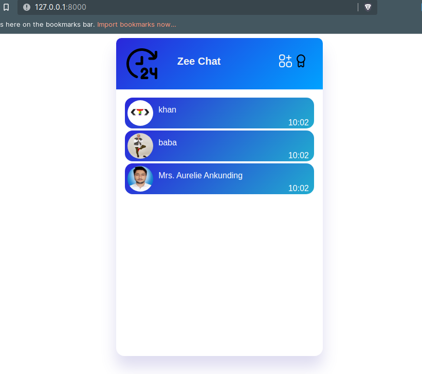

# Zee Chat 
A Multi User Chat Application With Laravel and Livewire. where you can chat with multiple frinds at the same time. i build this with php Laravel and Livewire.

## Quick Start

Clone the Project
```
git clone https://github.com/tauseedzaman/laravel-multi-user-chat-app
```

change directory
```
cd laravel-multi-user-chat-app
```
install dependencies
```
composer install
```
create .env file

```
cp .env.example .env
```
create unique key for this project
```
php artisan key:generate
```
migrate migrations
```
php artisan migrate
```
seed the fake data
```
php artisan db:seed
```
start laravel serve
```
php artisan serve
```
now just visite this url
[http://127.0.0.1:8000](http://127.0.0.1:8000)

## Demo Screenshots



